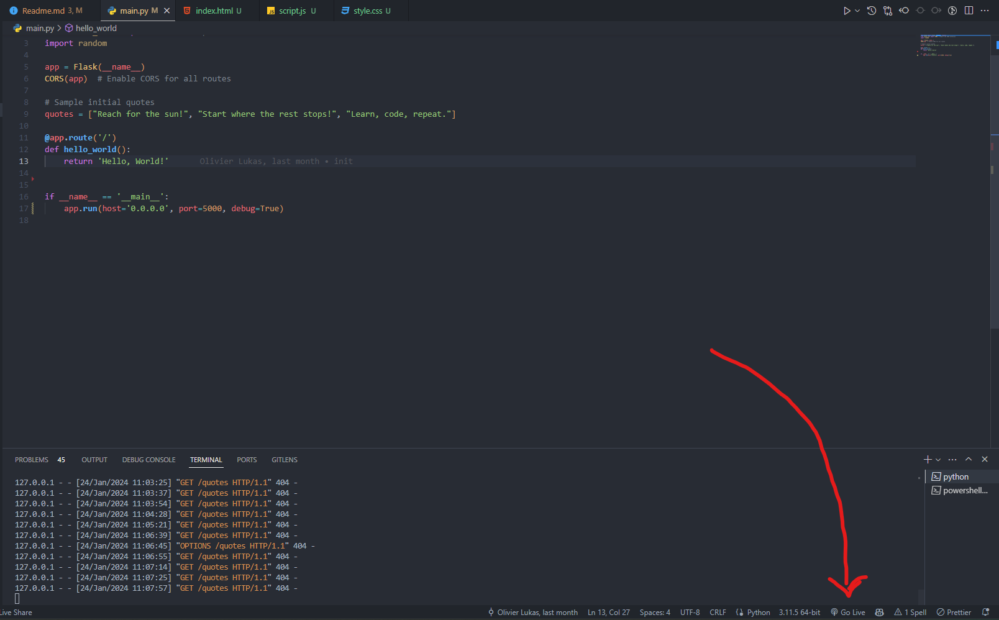
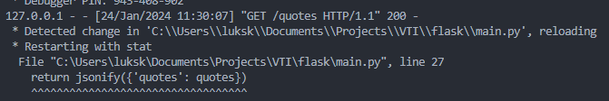

# Flask Quote API


## Doel

In deze oefening maken we een API met Flask. Deze API zal quotes opslaan en weergeven. De quotes worden opgeslagen in een lijst. Een API wordt gebruikt om data te delen tussen verschillende applicaties. In dit geval zal de API de quotes delen met een webapplicatie.

## Uitleg

### 1. Voorbereiding

Zorg ervoor dat je Python 3.x hebt geïnstalleerd. Installeer vervolgens Flask en Flask-CORS met behulp van de volgende commando's:

```bash
pip install flask
pip install flask-cors
```

Navigeer naar de 'frontend' map en klik op 'index.html'. Start daarna the web applicatie met 'Live Server' in Visual Studio Code. Er zal een browser openen met de webapplicatie in je standaard browser.



Hierop kan je de API testen. Je zal zien dat de API nog niet werkt. Dit komt omdat we de endpoints nog niet hebben aangemaakt. Geen zorgen, aan de webapplicatie moet je niets veranderen. Deze zal automatisch de data van de API ophalen en weergeven.

Start nu de Flask applicatie op. Dit doe je door het volgende commando uit te voeren in de terminal:

```bash
python main.py
```

Als alles goed is gegaan, zal je een bericht zien dat de applicatie draait op [http://127.0.0.1:5000](http://127.0.0.1:5000).

Let op! Als je een fout maakt in de code, zal de applicatie crashen. Je zal dan een foutmelding zien in de terminal. Als je de fout hebt opgelost, moet je de applicatie opnieuw opstarten met het bovenstaande commando.


### 2. Lijst met quotes aanmaken

Voeg enkele initiële quotes toe om mee te beginnen. Deze worden opgehaald en weergegeven door de API.

```python
quotes = ["Reach for the sun!", "Start where the rest stops!", "Learn, code, repeat."]
```

### 3. API endpoints aanmaken

### GET /quotes: Geeft alle quotes terug

```python

@app.route('/quotes', methods=['GET'])
def get_quotes():
    return jsonify({'quotes': quotes})

```

Als je nu de webapplicatie opnieuw laadt, zal je de quotes zien verschijnen.

---

### POST /quotes: Voegt een quote toe aan de lijst

Nu is het tijd om zelf een endpoint aan te maken. We gaan een quote toevoegen aan de lijst met quotes.

We zullen eerst de data uit de request halen. Deze data wordt in JSON formaat verstuurd. We gebruiken de methode `get_json()` om de data uit de request te halen.

```python
@app.route('/quotes', methods=['POST'])
def add_quote():
    data = request.get_json()
```

We verwachten een 'quote' in de data. Deze quote voegen we toe aan de lijst met quotes.

```python
quotes.append(data['quote'])
```

Als laatste geven we de lijst met quotes terug. Dit is niet verplicht, maar het is wel handig om te zien of de quote is toegevoegd. Let op de indentatie (tab)!

```python
return jsonify({'quotes': quotes})
```

Als dit gelukt is, is het mogelijk om een quote toe te voegen aan de lijst.  Als je de quote hebt toegevoegd, zal die verschijnen in lijst met quotes in de webapplicatie.

### GET /qoute: geeft een willigkeurige quote terug.

Probeer deze zelfstandig uit te werken. Je kan de random module gebruiken om een willekeurige quote te selecteren.

```python
import random

randomQuote = random.choice(quotes)
```

Als je hiermee klaar bent, roep je een van de leerlingen aan om de oplossing te tonen. Wees vrij om nog endpoints toe te voegen. 

### DELETE /quotes/clear: Verwijder alle quotes.

Dit endpoint is anders, omdat je een andere CRUD operatie gebruikt. Je gebruikt namelijk DELETE in plaats van POST. 

Maak nu een nieuw endpoint aan met de Delete methode. 
Om een globale variabele te wijzigen moet je hem initialiseren in je functie als een global variable.

```python
global quotes
quotes = []
```

Vergeet ook niet een gepast bericht te sturen na dat alle quotes verwijderd zijn. 

### GET /quotes/<int:index>: Vraage een specifieke quote.

Dit endpoint is speciaal omdat je een specifieke quote vraagt. Je geeft een ID me (BV: 0,1,2,...) en je verwacht dan de quote terug te krijgen die op die plaats in de array staat.

```python
def get_specific_quote(index):
```

Check eerst en vooral ofdat de gevraagde id in de lengte van de array zit (Je kan dit doen met een if statement).

Indien je ID groter is of gelijk aan nul of kleiner is dan de lengte van de array kan je de juiste quote terug sturen. 


### DELETE /quotes/<int:index>: Verwijder een specifieke quote.

Nu is het tijd om eens een specifieke quote te verwijderen. Maak gebruik van de vorige twee oefeningen om deze oefening op te lossen. 
