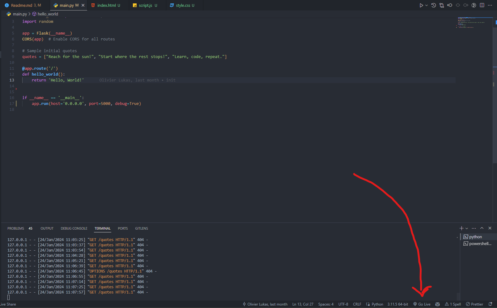

# Flask Quote API


## Doel

In deze oefening maken we een API met Flask. Deze API zal quotes opslaan en weergeven. De quotes worden opgeslagen in een lijst. Een API wordt gebruikt om data te delen tussen verschillende applicaties. In dit geval zal de API de quotes delen met een webapplicatie.

## Uitleg

### 1. Voorbereiding

Zorg ervoor dat je Python 3.x hebt geïnstalleerd. Installeer vervolgens Flask en Flask-CORS met behulp van de volgende commando's:

```bash
pip install flask
pip install flask-cors
```

Start the web applicatie met 'Live Server' in Visual Studio Code



### 2. Lijst met quotes aanmaken

Voeg enkele initiële quotes toe om mee te beginnen. Deze worden opgehaald en weergegeven door de API.

```python
quotes = ["Reach for the sun!", "Start where the rest stops!", "Learn, code, repeat."]
```

### 3. API endpoints aanmaken

### GET /quotes: Geeft alle quotes terug

```python

@app.route('/quotes', methods=['GET'])
def get_quotes():
    return jsonify({'quotes': quotes})

```

---

### POST /quotes: Voegt een quote toe aan de lijst

We zullen eerst de data uit de request halen. Deze data wordt in JSON formaat verstuurd. We gebruiken de methode get_json() om de data uit de request te halen.

```python
@app.route('/quotes', methods=['POST'])
def add_quote():
    data = request.get_json()
```

We verwachten een 'quote' in de data. Deze quote voegen we toe aan de lijst met quotes.

```python
quotes.append(data['quote'])
```

We geven de quote terug als response.

```python
return jsonify({'quote': data['quote']})
```

---

### GET /qoute: geeft een willigkeurige quote terug

Probeer deze zelfstandig uit te werken. Je kan de random module gebruiken om een willekeurige quote te selecteren.

```python
import random

randomQuote = random.choice(quotes)
```

Als je hiermee klaar bent, roep je een van de leerlingen aan om de oplossing te tonen. Wees vrij om nog endpoints toe te voegen. Bijvoorbeeld om een quote te verwijderen of te wijzigen.
